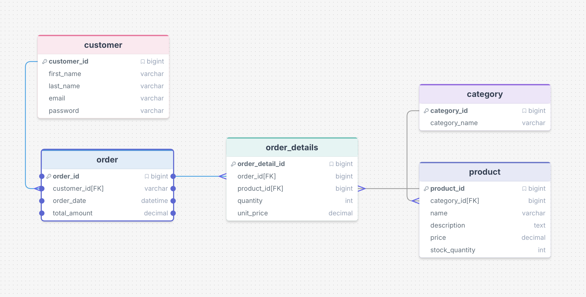
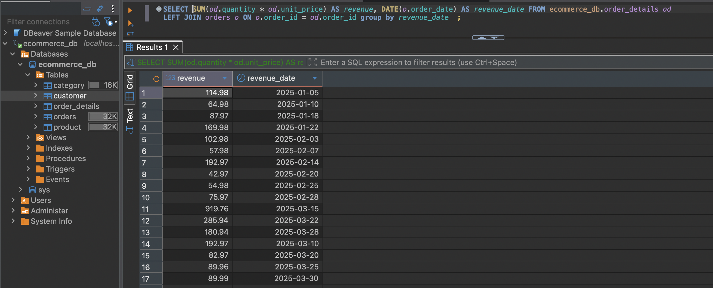
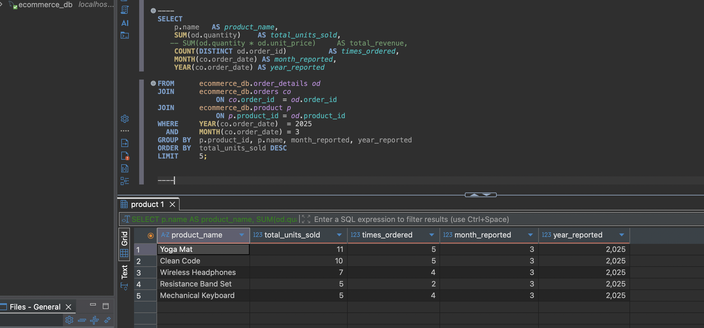
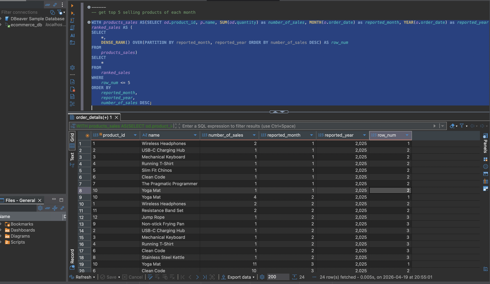
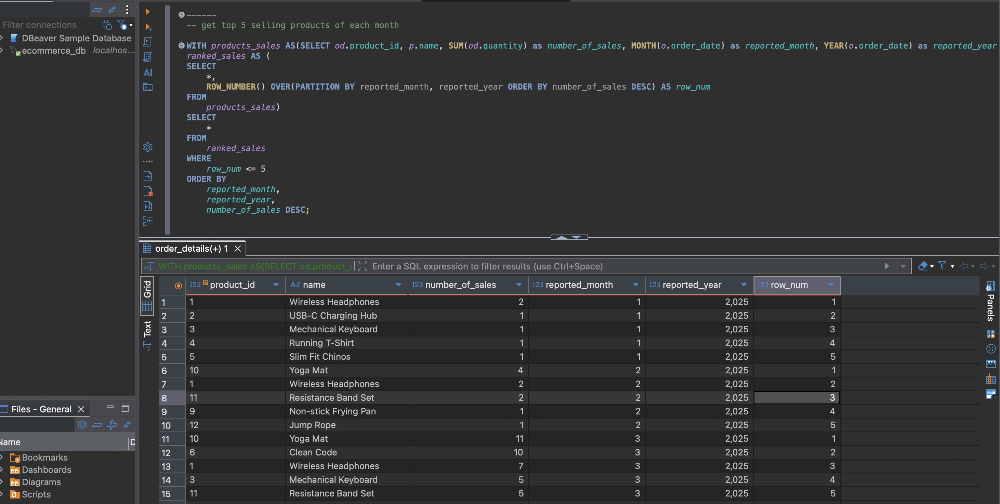
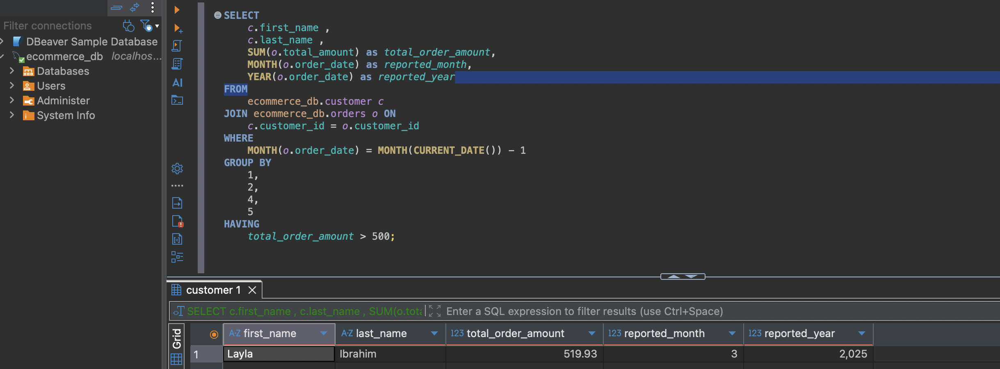
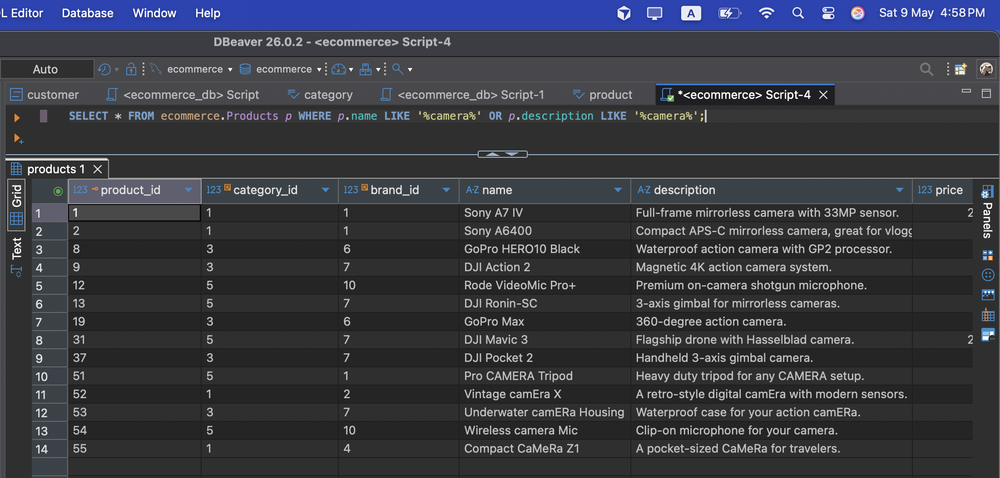

# eCommerce DB Practice

A simple eCommerce database built with MySQL for learning and practicing SQL queries.
This project covers schema design, relational modeling, dummy data insertion, and analytical reporting queries.

---

## DB Schema



The database consists of 5 tables:

| Table | Description |
|---|---|
| `customer` | Stores customer account information |
| `category` | Product categories |
| `product` | Product catalog linked to categories |
| `orders` | Customer orders with date and total amount |
| `order_details` | Line items for each order (product, quantity, unit price) |

---

## Creating the Database

```sql
/usr/local/mysql/bin/mysql -u root -p

CREATE DATABASE ecommerce_db;

USE ecommerce_db;

-- customer table
CREATE TABLE ecommerce_db.customer(
    customer_id BIGINT NOT NULL AUTO_INCREMENT PRIMARY KEY,
    first_name  VARCHAR(150) NOT NULL,
    last_name   VARCHAR(150) NOT NULL,
    email       VARCHAR(255) NOT NULL UNIQUE,
    password    VARCHAR(255)
);

-- category table
CREATE TABLE ecommerce_db.category(
    category_id   BIGINT NOT NULL AUTO_INCREMENT PRIMARY KEY,
    category_name VARCHAR(200) NOT NULL
);

-- product table
CREATE TABLE ecommerce_db.product(
    product_id     BIGINT NOT NULL AUTO_INCREMENT PRIMARY KEY,
    category_id    BIGINT NOT NULL,
    name           VARCHAR(150) NOT NULL,
    description    TEXT,
    price          DECIMAL(10,2),
    stock_quantity INT NOT NULL DEFAULT 0,
    CONSTRAINT fk_product_category
        FOREIGN KEY (category_id)
        REFERENCES ecommerce_db.category (category_id)
);

-- orders table
CREATE TABLE ecommerce_db.orders(
    order_id     BIGINT NOT NULL AUTO_INCREMENT PRIMARY KEY,
    customer_id  BIGINT NOT NULL,
    order_date   DATETIME,
    total_amount DECIMAL(10,2),
    CONSTRAINT fk_customer_order_customer
        FOREIGN KEY (customer_id)
        REFERENCES ecommerce_db.customer (customer_id)
);

-- order_details table
CREATE TABLE ecommerce_db.order_details(
    order_detail_id BIGINT NOT NULL AUTO_INCREMENT PRIMARY KEY,
    order_id        BIGINT NOT NULL,
    product_id      BIGINT NOT NULL,
    quantity        INT NOT NULL,
    unit_price      DECIMAL(10,2) NOT NULL,
    CONSTRAINT fk_order_detail_order
        FOREIGN KEY (order_id)
        REFERENCES ecommerce_db.orders (order_id),
    CONSTRAINT fk_order_detail_product
        FOREIGN KEY (product_id)
        REFERENCES ecommerce_db.product (product_id)
);
```

---

## Filling the DB with Dummy Data

```sql
-- 1. category (no FKs, insert first)
INSERT INTO ecommerce_db.category (category_name) VALUES
  ('Electronics'),
  ('Clothing'),
  ('Home & Kitchen'),
  ('Books'),
  ('Sports & Outdoors');

-- 2. product (12 products)
INSERT INTO ecommerce_db.product
  (product_id, category_id, name, description, price, stock_quantity)
VALUES
(1,  1, 'Wireless Headphones',      'Over-ear noise cancelling, 30hr battery.',        79.99, 120),
(2,  1, 'USB-C Charging Hub',       '7-in-1 hub with HDMI, USB 3.0 and PD charging.',  34.99, 200),
(3,  1, 'Mechanical Keyboard',      'TKL layout, blue switches, RGB backlit.',          89.99,  60),
(4,  2, 'Running T-Shirt',          'Lightweight moisture-wicking fabric, unisex.',     19.99, 350),
(5,  2, 'Slim Fit Chinos',          'Cotton stretch chinos available in 4 colours.',    44.99, 180),
(6,  3, 'Clean Code',               'A handbook of agile software craftsmanship.',      29.99,  90),
(7,  3, 'The Pragmatic Programmer', 'Your journey to mastery, 20th anniversary ed.',   34.99,  75),
(8,  4, 'Stainless Steel Kettle',   '1.7L cordless kettle with auto shut-off.',        24.99, 140),
(9,  4, 'Non-stick Frying Pan',     '28cm ceramic non-stick, oven safe to 220C.',      32.99,  95),
(10, 5, 'Yoga Mat',                 '6mm thick anti-slip mat with carry strap.',        22.99, 210),
(11, 5, 'Resistance Band Set',      'Set of 5 bands with varying resistance levels.',  14.99, 300),
(12, 5, 'Jump Rope',                'Speed rope with ball bearings, adjustable.',      12.99, 250);

-- 3. customer (10 customers)
-- passwords are bcrypt hashes of "Password123!"
INSERT INTO ecommerce_db.customer
  (customer_id, first_name, last_name, email, password)
VALUES
(1,  'Ahmed',   'Hassan',   'ahmed.hassan@email.com',    '$2b$12$KIXSq3bqNwzLJk8mP1eONeZv7a5oQ1Y2uXdRtGhMcWpBfLsAjE3uy'),
(2,  'Sara',    'Mahmoud',  'sara.mahmoud@email.com',    '$2b$12$KIXSq3bqNwzLJk8mP1eONeZv7a5oQ1Y2uXdRtGhMcWpBfLsAjE3uy'),
(3,  'Omar',    'Khalil',   'omar.khalil@email.com',     '$2b$12$KIXSq3bqNwzLJk8mP1eONeZv7a5oQ1Y2uXdRtGhMcWpBfLsAjE3uy'),
(4,  'Nour',    'El-Sayed', 'nour.elsayed@email.com',    '$2b$12$KIXSq3bqNwzLJk8mP1eONeZv7a5oQ1Y2uXdRtGhMcWpBfLsAjE3uy'),
(5,  'Layla',   'Ibrahim',  'layla.ibrahim@email.com',   '$2b$12$KIXSq3bqNwzLJk8mP1eONeZv7a5oQ1Y2uXdRtGhMcWpBfLsAjE3uy'),
(6,  'Youssef', 'Mostafa',  'youssef.mostafa@email.com', '$2b$12$KIXSq3bqNwzLJk8mP1eONeZv7a5oQ1Y2uXdRtGhMcWpBfLsAjE3uy'),
(7,  'Mariam',  'Fawzy',    'mariam.fawzy@email.com',    '$2b$12$KIXSq3bqNwzLJk8mP1eONeZv7a5oQ1Y2uXdRtGhMcWpBfLsAjE3uy'),
(8,  'Khaled',  'Nasser',   'khaled.nasser@email.com',   '$2b$12$KIXSq3bqNwzLJk8mP1eONeZv7a5oQ1Y2uXdRtGhMcWpBfLsAjE3uy'),
(9,  'Dina',    'Salah',    'dina.salah@email.com',      '$2b$12$KIXSq3bqNwzLJk8mP1eONeZv7a5oQ1Y2uXdRtGhMcWpBfLsAjE3uy'),
(10, 'Tarek',   'Abdallah', 'tarek.abdallah@email.com',  '$2b$12$KIXSq3bqNwzLJk8mP1eONeZv7a5oQ1Y2uXdRtGhMcWpBfLsAjE3uy');

-- 4. orders (20 orders)
INSERT INTO ecommerce_db.orders
  (order_id, customer_id, order_date, total_amount)
VALUES
-- January
(1,  1, '2025-01-05 09:00:00',  114.98),
(2,  2, '2025-01-10 11:30:00',   64.98),
(3,  3, '2025-01-18 14:00:00',   87.97),
(4,  6, '2025-01-22 16:00:00',  124.98),
-- February
(5,  4, '2025-02-03 10:00:00',   94.98),
(6,  5, '2025-02-07 13:00:00',   57.98),
(7,  7, '2025-02-14 09:30:00',  192.97),
(8,  8, '2025-02-20 15:00:00',   42.97),
(9,  9, '2025-02-25 11:00:00',   54.98),
(10,10, '2025-02-28 17:00:00',   75.97),
-- March
(11, 2, '2025-03-15 08:00:00',  208.94),
(12, 2, '2025-03-22 10:00:00',  285.94),
(13, 3, '2025-03-15 12:00:00',  224.96),
(14, 3, '2025-03-28 14:00:00',  180.94),
(15, 5, '2025-03-15 16:00:00',  519.93),
(16, 1, '2025-03-10 09:00:00',  279.97),
(17, 6, '2025-03-20 11:00:00',   82.97),
(18, 7, '2025-03-25 13:00:00',   89.97),
(19, 8, '2025-03-30 15:00:00',   89.99),
(20, 9, '2025-03-15 17:30:00',   47.98);

-- 5. order_details (48 rows)
INSERT INTO ecommerce_db.order_details
  (order_detail_id, order_id, product_id, quantity, unit_price)
VALUES
-- orders 1-4 (January)
(1,  1,  1, 1, 79.99), (2,  1,  2, 1, 34.99),
(3,  2,  6, 1, 29.99), (4,  2,  7, 1, 34.99),
(5,  3,  4, 1, 19.99), (6,  3,  5, 1, 44.99), (7,  3, 10, 1, 22.99),
(8,  4,  1, 1, 79.99), (9,  4,  3, 1, 89.99),
-- orders 5-10 (February)
(10, 5,  1, 1, 79.99), (11, 5, 10, 1, 22.99),
(12, 6,  8, 1, 24.99), (13, 6,  9, 1, 32.99),
(14, 7,  1, 1, 79.99), (15, 7,  3, 1, 89.99), (16, 7, 10, 1, 22.99),
(17, 8, 11, 2, 14.99), (18, 8, 12, 1, 12.99),
(19, 9,  2, 1, 34.99), (20, 9,  4, 1, 19.99),
(21,10,  6, 1, 29.99), (22,10, 10, 2, 22.99),
-- orders 11-20 (March)
(23,11,  1, 1, 79.99), (24,11,  6, 2, 29.99), (25,11, 10, 3, 22.99),
(26,12,  3, 2, 89.99), (27,12,  6, 2, 29.99), (28,12, 10, 2, 22.99),
(29,13,  1, 2, 79.99), (30,13,  6, 1, 29.99), (31,13,  7, 1, 34.99),
(32,14,  3, 1, 89.99), (33,14, 10, 2, 22.99), (34,14, 11, 3, 14.99),
(35,15,  1, 3, 79.99), (36,15, 10, 3, 22.99), (37,15,  6, 3, 29.99), (38,15, 12, 3, 12.99),
(39,16,  3, 1, 89.99), (40,16,  1, 1, 79.99), (41,16, 10, 1, 22.99),
(42,17,  8, 2, 24.99), (43,17,  9, 1, 32.99),
(44,18,  6, 2, 29.99), (45,18, 11, 2, 14.99),
(46,19,  3, 1, 89.99),
(47,20,  2, 1, 34.99), (48,20, 12, 1, 12.99);
```

---

## Practice Queries

### Q1 — Daily Revenue Report

Generate a daily report of the total revenue for a specific date.



```sql
SELECT
    SUM(od.quantity * od.unit_price) AS revenue,
    DATE(o.order_date)               AS revenue_date
FROM ecommerce_db.order_details od
LEFT JOIN ecommerce_db.orders o ON o.order_id = od.order_id
GROUP BY revenue_date;
```

---

### Q2 — Monthly Top-Selling Products Report

Generate a monthly report of the top-selling products in a given month.



```sql
SELECT
    p.name                        AS product_name,
    SUM(od.quantity)              AS total_units_sold,
    COUNT(DISTINCT co.order_id)   AS times_ordered,
    MONTH(co.order_date)          AS month_reported,
    YEAR(co.order_date)           AS year_reported
FROM ecommerce_db.order_details od
JOIN ecommerce_db.orders  co ON co.order_id  = od.order_id
JOIN ecommerce_db.product p  ON p.product_id = od.product_id
WHERE  YEAR(co.order_date)  = 2025
  AND  MONTH(co.order_date) = 3
GROUP BY p.product_id, p.name, month_reported, year_reported
ORDER BY total_units_sold DESC
LIMIT 5;
```

#### Alternative Approach 1 — Window Function with `ROW_NUMBER()`

Assigns a unique rank per month; ties get different row numbers (no shared ranks).



```sql
WITH products_sales AS (
    SELECT
        od.product_id,
        p.name,
        SUM(od.quantity)    AS number_of_sales,
        MONTH(o.order_date) AS reported_month,
        YEAR(o.order_date)  AS reported_year
    FROM ecommerce_db.order_details od
    JOIN ecommerce_db.orders  o ON o.order_id  = od.order_id
    JOIN ecommerce_db.product p ON p.product_id = od.product_id
    GROUP BY od.product_id, p.name, reported_month, reported_year
),
ranked_sales AS (
    SELECT
        *,
        ROW_NUMBER() OVER (PARTITION BY reported_month, reported_year ORDER BY number_of_sales DESC) AS row_num
    FROM products_sales
)
SELECT *
FROM ranked_sales
WHERE row_num <= 5
ORDER BY reported_month, reported_year, number_of_sales DESC;
```

#### Alternative Approach 2 — Window Function with `DENSE_RANK()`

Assigns shared ranks for tied values; no gaps in rank numbers, so more than 5 rows can appear if ties exist at rank 5.



```sql
WITH products_sales AS (
    SELECT
        od.product_id,
        p.name,
        SUM(od.quantity)    AS number_of_sales,
        MONTH(o.order_date) AS reported_month,
        YEAR(o.order_date)  AS reported_year
    FROM ecommerce_db.order_details od
    JOIN ecommerce_db.orders  o ON o.order_id  = od.order_id
    JOIN ecommerce_db.product p ON p.product_id = od.product_id
    GROUP BY od.product_id, p.name, reported_month, reported_year
),
ranked_sales AS (
    SELECT
        *,
        DENSE_RANK() OVER (PARTITION BY reported_month, reported_year ORDER BY number_of_sales DESC) AS row_num
    FROM products_sales
)
SELECT *
FROM ranked_sales
WHERE row_num <= 5
ORDER BY reported_month, reported_year, number_of_sales DESC;
```

> **`ROW_NUMBER` vs `DENSE_RANK`:** Use `ROW_NUMBER` when you need exactly N results per partition. Use `DENSE_RANK` when tied products should share the same rank and all ties should be included.

---

### Q3 — Customers with Orders Totaling More Than $500 in the Past Month

Retrieve a list of customers who have placed orders totaling more than $500 in the past month, including their names and total order amounts.



```sql
SELECT
    c.first_name,
    c.last_name,
    SUM(o.total_amount) AS total_order_amount,
    MONTH(o.order_date) AS reported_month,
    YEAR(o.order_date)  AS reported_year
FROM ecommerce_db.customer c
JOIN ecommerce_db.orders o ON c.customer_id = o.customer_id
WHERE MONTH(o.order_date) = MONTH(CURRENT_DATE()) - 1
GROUP BY 1, 2, 4, 5
HAVING total_order_amount > 500;
```

---

## Denormalization

### How to apply a denormalization mechanism on the `customer` and `orders` entities?

By adding `first_name`, `last_name`, and `email` (if needed) from the `customer` table directly into the `orders` table, so that most customer-orders related queries no longer require a JOIN with the `customer` table.

**Before (normalized):**

```sql
SELECT c.first_name, c.last_name, o.total_amount
FROM ecommerce_db.orders o
JOIN ecommerce_db.customer c ON c.customer_id = o.customer_id;
```

**After (denormalized `orders` table):**

```sql
-- orders table would include: first_name, last_name, email columns
SELECT first_name, last_name, total_amount
FROM ecommerce_db.orders;
```

---

## Week 4

### Query 1 — Search Products Containing "camera" in Name or Description

Write a SQL query to return all products where the word **camera** appears in either the product name or the description (case sensitivity depends on your MySQL collation).



```sql
SELECT *
FROM ecommerce.Products p
WHERE p.name LIKE '%camera%'
   OR p.description LIKE '%camera%';
```

---

### Query 2 — Popular Products in the Same Category (Exclude Already Purchased)

Design a query that recommends popular products in a given category for a specific customer: rank items by total units sold across all orders, but exclude any product that customer has already purchased. The example below uses category **Lenses** and customer **`customer_id = 1`**; change those filters for other categories or customers.


```sql
SELECT
    p.product_id,
    p.name AS product_name,
    c.name AS category_name,
    SUM(od.quantity) AS totalProductPurchase
FROM Products p
JOIN Categories c
    ON p.category_id = c.category_id
JOIN OrderDetails od
    ON p.product_id = od.product_id
WHERE c.name = 'Lenses'
  AND p.product_id NOT IN (
      SELECT od2.product_id
      FROM OrderDetails od2
      JOIN Orders o2
          ON od2.order_id = o2.order_id
      WHERE o2.customer_id = 1
  )
GROUP BY
    p.product_id,
    p.name,
    c.name
ORDER BY totalProductPurchase DESC;
```